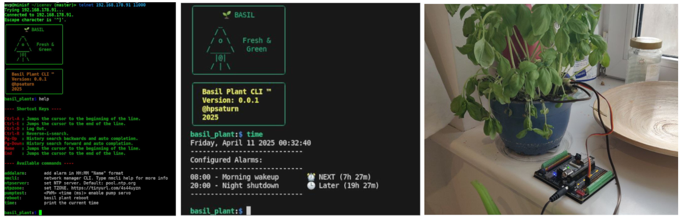
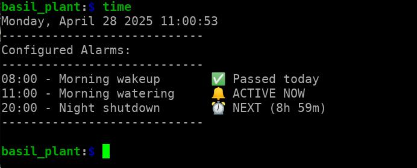
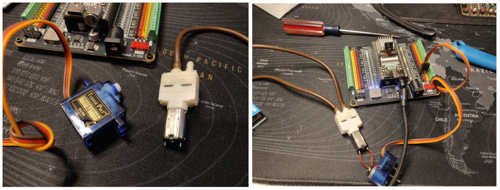
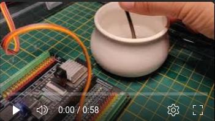

# ESP32 Plant Watering CLI

Scheduler and pump driver using a basic command line over an ESP32



## TODO

- [x] WiFi CLI Manager added
- [x] Hardcoded scheduler
- [x] Water pump enable via CLI
- [x] Dynamic scheduler on memory
- [x] Auto water pump via alarm
- [ ] Dynamic scheduler on flash
- [ ] Moisture sensor via Bluetooth LE connection
- [ ] Auto plant watering mode

## Commands

For now, these are the available commands:

```shell
basil_plant:$ help

---- Shortcut Keys ----

Ctrl-A : Jumps the cursor to the beginning of the line.
Ctrl-E : Jumps the cursor to the end of the line.
Ctrl-D : Log Out.
Ctrl-R : Reverse-i-search.
Pg-Up  : History search backwards and auto completion.
Pg-Down: History search forward and auto completion.
Home   : Jumps the cursor to the beginning of the line.
End    : Jumps the cursor to the end of the line.

---- Available commands ----

addalarm: 	add alarm in "HH:MM Name" format
nmcli: 		network manager CLI. Type nmcli help for more info
ntpserver: 	set NTP server. Default: pool.ntp.org
ntpzone: 	set TZONE. https://tinyurl.com/4s44uyzn
pumptest: 	<PWM> <time (ms)> enable pump servo
reboot: 	basil plant reboot
time: 		print the current time
```

## Usage

Please install first [PlatformIO](http://platformio.org/) open source ecosystem for IoT development compatible with **Arduino** IDE and its command line tools (Windows, MacOs and Linux). Also, you may need to install [git](http://git-scm.com/) in your system. After install that you should have the command line tools of PlatformIO. Please test it with `pio --help`. Then please run the next command for build and upload the firmware:

```bash
pio run --target upload
```

### Configure WiFi

Full WiFi manager commands:

```shell
nmcli help
```

Quick connection:

```shell
nmcli connect your_ssid password "your_passw"
```

Check connection:

```shell
nmcli status
```

#### Remote access

From your PC, access to the plant, changing in the next command and put your IP address of your board that show the status command, like this:

```shell
telnet 192.168.178.91 11000
```

### Pump test

For instance, for a PWM of 105 and 10 seconds:

```shell
pumptest 105 10000
```

### Add alarm

```shell
addalarm 20:30 Alarm Name
```

### Alarm status

```shell
time
```



## Hardware



Using this simple servo-controller and this pump from Aliexpress is enough for now. For that you only need connect the motor wires of the old servo cotroller to the pump motor. And not more :D

Possible compatible water pumps:

- [Micro Water Pump DC 3V 5V Mini](https://s.click.aliexpress.com/e/_onhAe0V)
- [Micro M20 Water Pump DC 3.7-5V](https://s.click.aliexpress.com/e/_okmECet)

ESP32 tested:

- [Freenove ESP32S3 WRover board](https://www.amazon.de/FREENOVE-ESP32-S3-WROOM-Dual-Core-Microcontroller-Wireless/dp/B0BMQ8F7FN)
- [Freenove ESP32S3 WRover shield](https://www.amazon.de/-/en/Freenove-Breakout-ESP32-S3-Terminal-Outputs/dp/B0CD2512JV)

## Demo

[](https://youtu.be/RiUBDuAdhD0)